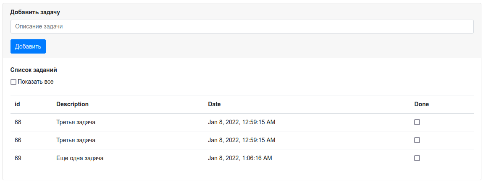
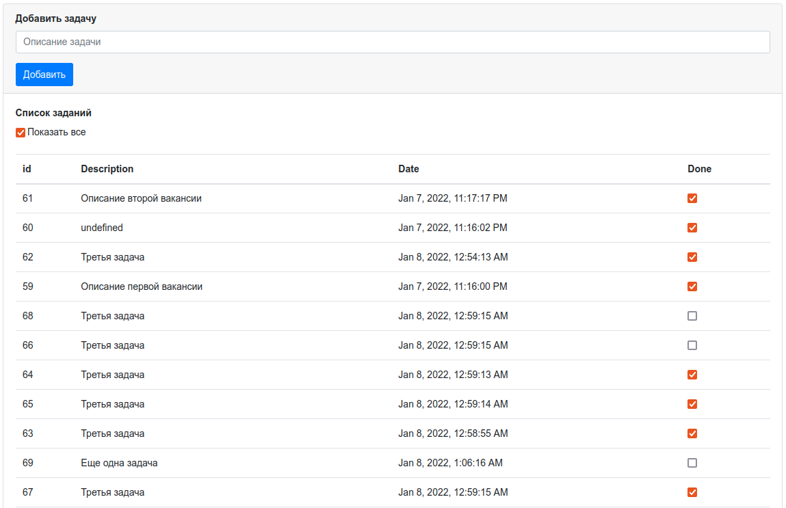
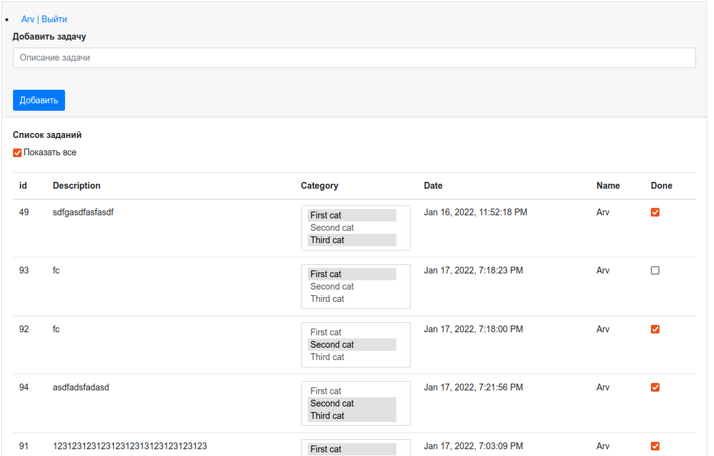

# job4j_ToDo List

## Проект - Список дел
Страница на которой можно добавить новую задачу и она сразу отобразится в списке,
если отметить задачу галочкой, то она пометится как выполненная и пропадет

При нажатии на чекбокс Показать все, будут отображаться все задачи, с соответствующими
пометками о выполнении/ не выполнении

Выбор категорий, при нажатиии Ctrl можно выбрать больше одной категории

## Контакты для связи 
 arvikvan@gmail.com 
 @ArvikV

##Используемые технологии:
- Maven
- Java EE Servlet API
- Hibernate
- PostgreSQL
- Travis CI
- Apache Tomcat
- Java Script

